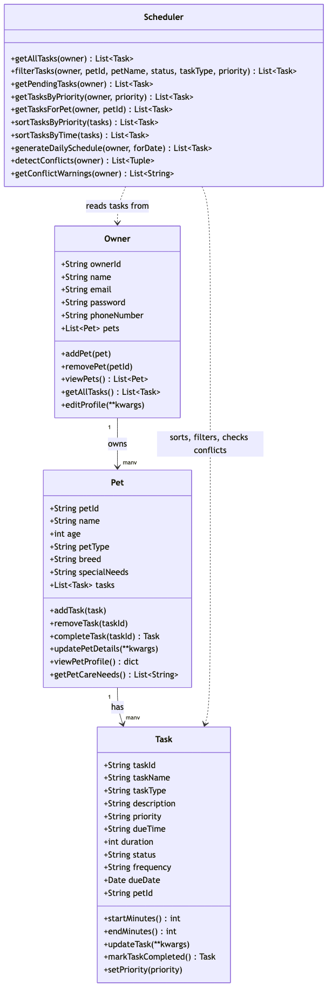

# PawPal+ (Module 2 Project)

You are building **PawPal+**, a Streamlit app that helps a pet owner plan care tasks for their pet.

## Scenario

A busy pet owner needs help staying consistent with pet care. They want an assistant that can:

- Track pet care tasks (walks, feeding, meds, enrichment, grooming, etc.)
- Consider constraints (time available, priority, owner preferences)
- Produce a daily plan and explain why it chose that plan

Your job is to design the system first (UML), then implement the logic in Python, then connect it to the Streamlit UI.

## What you will build

Your final app should:

- Let a user enter basic owner + pet info
- Let a user add/edit tasks (duration + priority at minimum)
- Generate a daily schedule/plan based on constraints and priorities
- Display the plan clearly (and ideally explain the reasoning)
- Include tests for the most important scheduling behaviors

## Getting started

### Setup

```bash
python -m venv .venv
source .venv/bin/activate  # Windows: .venv\Scripts\activate
pip install -r requirements.txt
```

### Suggested workflow

1. Read the scenario carefully and identify requirements and edge cases.
2. Draft a UML diagram (classes, attributes, methods, relationships).
3. Convert UML into Python class stubs (no logic yet).
4. Implement scheduling logic in small increments.
5. Add tests to verify key behaviors.
6. Connect your logic to the Streamlit UI in `app.py`.
7. Refine UML so it matches what you actually built.

## ✨ Features

- **Add owners, pets, and tasks** — a Streamlit form for owner info, pet profiles, and per-pet care tasks (title, type, due time, duration, priority, and recurrence).
- **Sorting by time** — `Scheduler.sort_tasks_by_time()` orders any task list chronologically by due time, breaking same-time ties by priority.
- **Sorting by priority** — `Scheduler.sort_tasks_by_priority()` groups tasks into high/medium/low tiers, chronological within each tier. Toggle between the two directly in the "Today's Schedule" section of the UI.
- **Filtering** — `Scheduler.filter_tasks()` narrows the task list by any combination of pet, status, task type, or priority in one pass.
- **Conflict warnings** — `Scheduler.get_conflict_warnings()` flags any two pending tasks whose time windows overlap (same-time or partial-duration collisions) and surfaces each one as a `st.warning` banner, naming both pets, both tasks, and their times, so the owner knows exactly what to reschedule.
- **Daily/weekly recurrence** — completing a task via "Mark a Task Complete" calls `Pet.complete_task()`; if the task repeats daily or weekly, its next occurrence is automatically scheduled and the UI reports the new due date.

## 🖥️ Sample Output

Run `python3 main.py` to see the schedule in the terminal:

```
Sorted by time (input order was shuffled):
  07:00  Morning Walk
  08:00  Breakfast
  08:30  Breakfast
  18:00  Evening Walk

Filter -> status='pending', pet_name='Mochi':
  14:00  Grooming
  08:30  Breakfast
  17:00  Playtime
  07:15  Vet Follow-up Call
  12:00  Nail Trim

Completed 'Grooming' (status=completed).
Auto-scheduled next occurrence: 'Grooming' on 2026-07-05 at 14:00 (status=pending)

====================================================
        TODAY'S SCHEDULE — PawPal+
====================================================
  Owner : Alex
  Pets  : Biscuit, Mochi
----------------------------------------------------
  TIME     TASK               PET          DUR  PRIORITY
----------------------------------------------------
  07:00    Morning Walk       Biscuit      30m  [high]
  07:15    Vet Follow-up Call Mochi        15m  [low]
  08:00    Breakfast          Biscuit      10m  [high]
  08:30    Breakfast          Mochi        10m  [high]
  12:00    Nail Trim          Biscuit      15m  [medium]
  12:00    Nail Trim          Mochi        15m  [medium]
  17:00    Playtime           Mochi        15m  [medium]
  18:00    Evening Walk       Biscuit      30m  [medium]
====================================================
  8 tasks scheduled  |  all pending
====================================================

2 schedule conflict(s) found:
  ! Conflict: Biscuit's 'Morning Walk' (07:00) overlaps Mochi's 'Vet Follow-up Call' (07:15)
  ! Conflict: Biscuit's 'Nail Trim' (12:00) overlaps Mochi's 'Nail Trim' (12:00)
```

## 🧪 Testing PawPal+

```bash
# Run the full test suite:
python -m pytest

# Run with coverage:
pytest --cov
```

The suite in `tests/test_pawpal.py` covers 23 tests across 5 areas:

- **Sorting** — `sort_tasks_by_time` returns chronological order and breaks same-time ties by priority; `sort_tasks_by_priority` groups by tier then time; sorting an empty list doesn't crash.
- **Recurrence** — completing a `daily`/`weekly` task returns a new `Task` due one day/week later and wires it back into the pet's task list; a `once` task returns `None` and isn't re-added; completing an unknown task ID is a no-op.
- **Conflict detection** — exact-same-time tasks and partially-overlapping-duration tasks are flagged; back-to-back tasks (end time == next start time) are not; completed tasks are excluded from conflict checks.
- **Edge cases** — a pet/owner with zero tasks doesn't error; an invalid priority raises `ValueError` on task creation and on filtering; `generate_daily_schedule` excludes tasks due on other dates.
- **Filtering** — `filter_tasks` correctly combines `pet_name`, `status`, and `priority` filters, and returns everything when called with no filters.

**Confidence level: ⭐⭐⭐⭐☆ (4/5)** — core scheduling logic (sorting, recurrence, conflicts) is well covered and all tests pass. Not yet covered: `Owner`/`Pet` CRUD edge cases (e.g. removing a pet/task mid-iteration) and the Streamlit UI layer in `app.py`.

Sample test output:

```
============================= test session starts ==============================
platform darwin -- Python 3.14.4, pytest-9.1.1, pluggy-1.6.0
rootdir: /path/to/ai110-module2show-pawpal-starter
plugins: anyio-4.14.0
collected 23 items

tests/test_pawpal.py .......................                             [100%]

============================== 23 passed in 0.02s ==============================
```

## 🗺️ System Design (UML)

The final class diagram (`diagrams/uml_final.mmd`, rendered below) reflects the actual implementation in `pawpal_system.py`: `Owner`, `Pet`, and `Task` hold data and mutate their own state, while the stateless `Scheduler` reads an `Owner`'s tasks and provides sorting, filtering, and conflict-detection on top — no separate `Schedule`/`Plan` classes, since the original draft's responsibilities (organizing and explaining a plan) turned out to belong on `Scheduler` and the UI layer instead.



## 📐 Smarter Scheduling

| Feature | Method(s) | Notes |
|---------|-----------|-------|
| Task sorting | `Scheduler.sort_tasks_by_time()`, `Scheduler.sort_tasks_by_priority()` | `sort_tasks_by_time` orders tasks chronologically by `due_time` (converted to minutes since midnight), breaking ties by priority. `sort_tasks_by_priority` orders by priority tier first, breaking ties chronologically. `generate_daily_schedule()` uses `sort_tasks_by_time` to build each day's agenda. |
| Filtering | `Scheduler.filter_tasks()` (+ shortcuts `get_pending_tasks()`, `get_tasks_by_priority()`, `get_tasks_for_pet()`) | One generic method filters by any combination of `pet_id`, `pet_name`, `status`, `task_type`, and `priority` in a single pass, instead of one hardcoded method per filter. |
| Conflict handling | `Scheduler.detect_conflicts()`, `Scheduler.get_conflict_warnings()` | Compares every pair of a day's pending tasks (`itertools.combinations`) and flags any whose `[start, end)` time windows overlap — catching both exact-same-time collisions and overlapping-duration collisions (e.g. a 30-minute walk that swallows a 15-minute call). `get_conflict_warnings()` returns printable warning strings instead of raising, so a conflicting schedule never crashes the app. |
| Recurring tasks | `Task.mark_task_completed()`, `Pet.complete_task()` | Completing a task with `frequency` of `"daily"` or `"weekly"` automatically creates and returns a new `Task` for the next occurrence (`due_date` advanced with `datetime.timedelta`), while the original stays `"completed"` as history. `Pet.complete_task()` wires the new occurrence back into the pet's task list. `generate_daily_schedule()` only shows tasks due on the target date, so a next-day occurrence doesn't appear early. |

## 📸 Demo Walkthrough

### UI features

The Streamlit app (`app.py`) is organized into four sections:

- **Owner** — enter the owner's name; a session-scoped `Owner` is created automatically.
- **Add a Pet** — enter name, species, breed, and age, then click **Add pet**. Added pets appear in a table with their live task count.
- **Schedule a Task** — pick a pet, then enter a task title, type, due time, duration, priority, and how often it repeats (`once`, `daily`, or `weekly`). Existing tasks for all pets are listed in a table with their status and recurrence. A **Mark a Task Complete** picker lets you complete any pending task.
- **Today's Schedule** — choose to sort by **Time** or **Priority**, then click **Generate schedule** to build the day's agenda from every pet's pending tasks due today.

### Example workflow

1. Enter an owner name and add a pet (e.g. "Rex", a dog).
2. Add two tasks for Rex: a "Morning Walk" at 08:00 (high priority, repeats daily) and a "Vet Call" also at 08:00 (medium priority, once).
3. Click **Generate schedule**. Because both tasks overlap, a `st.warning` banner reports `1 scheduling conflict(s) found` followed by a specific warning naming both tasks, times, and pets — so the owner immediately knows which task to reschedule instead of hunting through a table.
4. Switch the sort control to **Priority** and regenerate — the same tasks reorder with the high-priority walk first.
5. Under **Mark a Task Complete**, select "Morning Walk" and click **Mark complete**. Since it repeats daily, a `st.success` message confirms the next occurrence was auto-scheduled for tomorrow at the same time.

### Key Scheduler behaviors shown

- **Sorting** — `sort_tasks_by_time()` / `sort_tasks_by_priority()` reorder the same task list two different ways from one UI toggle.
- **Conflict warnings** — `get_conflict_warnings()` catches the same-time collision and renders a human-readable warning per pair, naming both pets and tasks.
- **Recurrence** — `Pet.complete_task()` auto-schedules the next occurrence of a daily/weekly task and the new due date is surfaced directly in the success message.

### Sample CLI output

`main.py` exercises the same backend outside the UI — run `python3 main.py`:

```
Sorted by time (input order was shuffled):
  07:00  Morning Walk
  08:00  Breakfast
  08:30  Breakfast
  18:00  Evening Walk

Filter -> status='pending', pet_name='Mochi':
  14:00  Grooming
  08:30  Breakfast
  17:00  Playtime
  07:15  Vet Follow-up Call
  12:00  Nail Trim

Completed 'Grooming' (status=completed).
Auto-scheduled next occurrence: 'Grooming' on 2026-07-05 at 14:00 (status=pending)

====================================================
        TODAY'S SCHEDULE — PawPal+
====================================================
  Owner : Alex
  Pets  : Biscuit, Mochi
----------------------------------------------------
  TIME     TASK               PET          DUR  PRIORITY
----------------------------------------------------
  07:00    Morning Walk       Biscuit      30m  [high]
  07:15    Vet Follow-up Call Mochi        15m  [low]
  08:00    Breakfast          Biscuit      10m  [high]
  08:30    Breakfast          Mochi        10m  [high]
  12:00    Nail Trim          Biscuit      15m  [medium]
  12:00    Nail Trim          Mochi        15m  [medium]
  17:00    Playtime           Mochi        15m  [medium]
  18:00    Evening Walk       Biscuit      30m  [medium]
====================================================
  8 tasks scheduled  |  all pending
====================================================

2 schedule conflict(s) found:
  ! Conflict: Biscuit's 'Morning Walk' (07:00) overlaps Mochi's 'Vet Follow-up Call' (07:15)
  ! Conflict: Biscuit's 'Nail Trim' (12:00) overlaps Mochi's 'Nail Trim' (12:00)
```

**Screenshot or video** *(optional)*: not included — the text walkthrough and CLI output above cover the gradable demo requirements.
